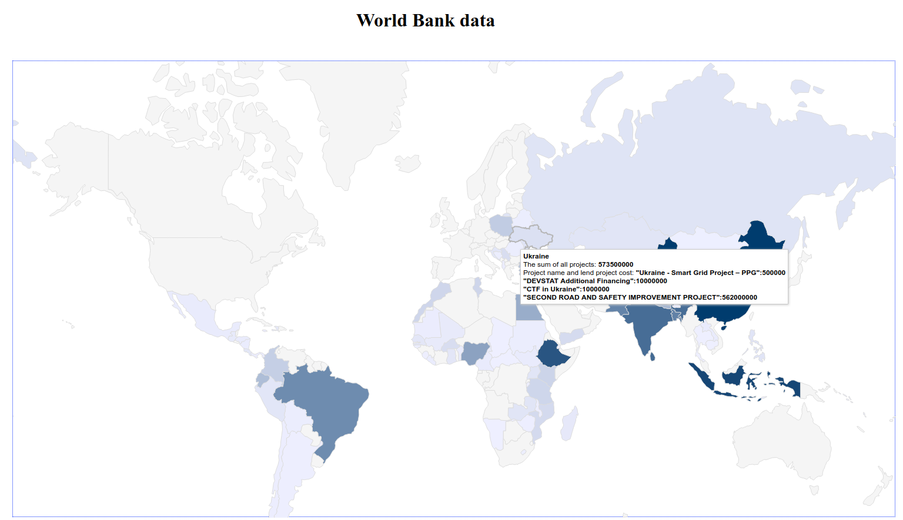

# Test task

1. Add world_bank.json to MongoDB - [link to documentation how to add data to the database](https://docs.mongodb.com/manual/reference/program/mongoimport/).
Use these settings:
    1. Database's name - world_bank
    2. Collection's name - world

2. [Create and to activate a virtual environment](https://docs.python.org/3/library/venv.html)

3. Install need packages - `pip install -r requirements.txt`

4. Run code - `python worlddata.py`

5. Here - [http://127.0.0.1:5000/](http://127.0.0.1:5000/) You will see a map with data.

For example:

